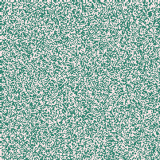
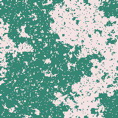
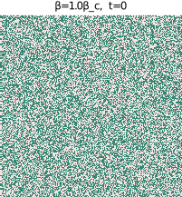

# Ising2D.jl - Julia package of the 2D Ising model

[](https://genkuroki.github.io/Ising2D.jl/stable)
[](https://genkuroki.github.io/Ising2D.jl/dev)
[](https://travis-ci.com/genkuroki/Ising2D.jl)

## Install

```
julia> ]
pkg> add https://github.com/genkuroki/Ising2D.jl
```

## Example

[Ising2D.ipynb](https://nbviewer.jupyter.org/github/genkuroki/Ising2D.jl/blob/master/Ising2D.ipynb)

```julia
using Ising2D
```

Generate a 100x100 random state of 2D Ising model:

```julia
s = rand_ising2d(200)
P0 = plot_ising2d(s)
```



Update the whole state 500 times:

```julia
ising2d!(s, β_ising2d, 500)
P1 = plot_ising2d(s)
```



Create PNG files:

```julia
Ising2D.Plots.png(P0, "s0.png")
Ising2D.Plots.png(P1, "s1.png")
```

Create the GIF animation of 2D Ising model:

```julia
s = rand_ising2d(200)
gif_ising2d(s, 1.0; nwarmups=0, nskips=1, nframes=500, fps=15)
```

